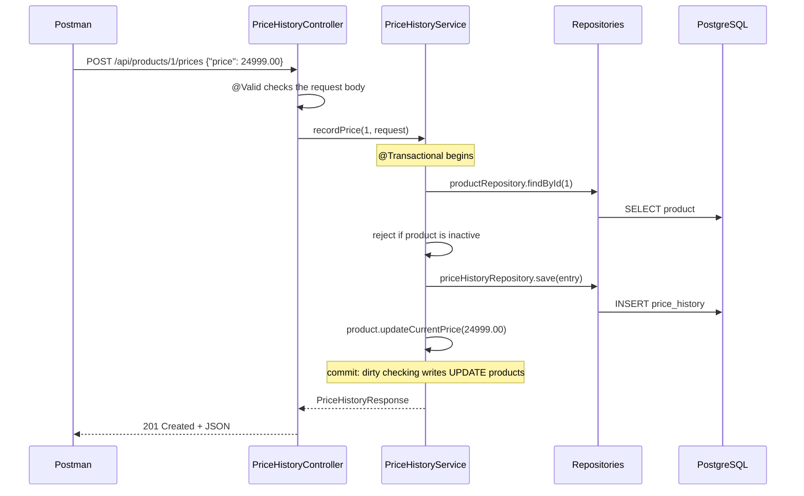

# PricePulse — Product Price Drop Tracker

PricePulse is a backend REST service, built with Java 21 and Spring Boot, for tracking product prices over time. A client registers a product with a target price and records new prices as they change. The service then reports whether the price has dropped to the target and analyzes the stored price history.

There is no frontend. The API is demonstrated with the included **Postman collection**.

---

## Table of Contents

- [Problem Statement](#problem-statement)
- [Features](#features)
- [Technology Stack](#technology-stack)
- [Architecture](#architecture)
- [Domain and Database Model](#domain-and-database-model)
- [Business Rules](#business-rules)
- [API Reference](#api-reference)
- [Example Requests and Responses](#example-requests-and-responses)
- [Validation and Error Handling](#validation-and-error-handling)
- [Running Locally](#running-locally)
- [Testing](#testing)
- [Key Concepts Demonstrated](#key-concepts-demonstrated)
- [Known Limitations and Possible Improvements](#known-limitations-and-possible-improvements)
- [Development History](#development-history)

---

## Problem Statement

Online prices change frequently. A buyer waiting for a product to become affordable faces three problems:

- They have to keep checking the product page manually.
- They forget earlier prices, so they cannot tell whether today's "sale" is a real drop.
- There is no single record that answers "what was the lowest price?" or "is the price going up or down?"

PricePulse stores each product's **current price**, a **target price**, and a **history of every recorded price**, and answers:

1. *Has this product reached my target price?*
2. *How has the price changed over time?*
3. *What are the lowest, highest and average prices, and which way did the latest price move?*

**Scope:** PricePulse does not scrape websites or call external product APIs. Prices are submitted to the API by the client (for example from Postman). This keeps the project focused on backend design: REST, persistence, relationships, validation and business logic.

---

## Features

- **Product management:** create, list, view, update and delete tracked products.
- **Price history:** record new prices. Every recording is stored as history and updates the product's current price in one transaction. The initial price is recorded automatically when a product is created.
- **Price drop detection:** reports whether the current price is at or below the target price, and how far above the target it still is.
- **Price analysis:** record count, lowest, highest and average price, number of increases, decreases and unchanged prices, and the most recent records.
- **Price trend:** current and previous price, direction of the latest change, change amount and percentage change.
- **Validation and consistent errors:** every error, including framework errors, is returned as `{ "status": ..., "message": ... }`, with no stack traces.
- **Active flag:** inactive products are paused, and recording a price for them is rejected.

---

## Technology Stack

| Area | Technology |
|------|------------|
| Language | Java 21, SQL |
| Framework | Spring Boot 3.5 (Spring MVC, Spring Data JPA, Bean Validation) |
| ORM | Hibernate (JPA implementation used by Spring Data JPA) |
| Database | PostgreSQL (developed against PostgreSQL 18) |
| Build | Maven (via the included Maven Wrapper) |
| Testing | JUnit 5, Mockito, AssertJ, Spring Boot Test (all from `spring-boot-starter-test`) |
| Tools | Git, Postman |

Deliberately **not** used: Lombok, Spring Security, Docker, message brokers, caches, NoSQL, frontends, scraping libraries or external APIs. All classes use plain Java constructors, getters and setters, or Java `record`s.

---

## Architecture

PricePulse uses a **layered architecture**. Each layer only talks to the layer directly below it.

```
            Postman (HTTP client)
                    │  JSON over HTTP
                    ▼
┌───────────────────────────────────────────┐
│ Controller layer   (@RestController)      │  URLs, HTTP methods, status codes,
│                                           │  @Valid request validation
└───────────────────────────────────────────┘
                    │  request DTOs / ids
                    ▼
┌───────────────────────────────────────────┐
│ Service layer      (@Service)             │  Business rules, @Transactional,
│                                           │  price-drop logic, Streams analysis,
│                                           │  entity → response DTO mapping
└───────────────────────────────────────────┘
                    │  entities
                    ▼
┌───────────────────────────────────────────┐
│ Repository layer   (JpaRepository)        │  Persistence only: CRUD and
│                                           │  derived query methods
└───────────────────────────────────────────┘
                    │  SQL generated by Hibernate
                    ▼
               PostgreSQL

  GlobalExceptionHandler (@RestControllerAdvice) turns every exception into a JSON error.
```

### Request flow example: recording a price



### Package structure

```
com.pricepulse
├── PricePulseApplication.java   Spring Boot entry point
├── controller                   ProductController, PriceHistoryController,
│                                PriceAnalysisController, PingController
├── service                      ProductService, PriceHistoryService,
│                                PriceAnalysisService, PriceChange (internal value object)
├── repository                   ProductRepository, PriceHistoryRepository
├── entity                       Product, PriceHistory (JPA entities), PriceMovement (enum)
├── dto                          Request/response records (API contract)
├── exception                    Custom exceptions + GlobalExceptionHandler
└── util                         MoneyUtils (2-decimal money scale, never silently rounded)
```

No `config` package was needed. Spring Boot auto-configuration plus `application.properties` covers everything.

---

## Domain and Database Model

```
┌──────────────────────────────┐            ┌──────────────────────────────┐
│ products                     │            │ price_history                │
├──────────────────────────────┤            ├──────────────────────────────┤
│ id            BIGINT      PK │ 1        * │ id           BIGINT       PK │
│ name          VARCHAR(200)   │────────────│ product_id   BIGINT       FK │
│ product_url   VARCHAR(1000) U│            │ price        NUMERIC(12,2)   │
│ current_price NUMERIC(12,2)  │            │ recorded_at  TIMESTAMP       │
│ target_price  NUMERIC(12,2)  │            └──────────────────────────────┘
│ currency      VARCHAR(3)     │              index (product_id, recorded_at)
│ active        BOOLEAN        │
│ created_at    TIMESTAMP      │
│ updated_at    TIMESTAMP      │
└──────────────────────────────┘
  All columns NOT NULL. U = unique constraint.
```

### JPA mapping decisions

| Mapping | Choice | Reason |
|---------|--------|--------|
| `PriceHistory.product` | `@ManyToOne(fetch = LAZY, optional = false)` + `@JoinColumn(name = "product_id")` | **Owning side**: it holds the foreign key. LAZY because `@ManyToOne` defaults to EAGER and listing history never needs the full product. |
| `Product.priceHistory` | `@OneToMany(mappedBy = "product", cascade = REMOVE)` | **Inverse side**. `mappedBy` prevents an extra join table. Only `REMOVE` is cascaded, because history has no meaning without its product but is created explicitly through its own repository. `CascadeType.ALL` is deliberately avoided. |
| Ids | `@GeneratedValue(strategy = IDENTITY)` | PostgreSQL identity columns. |
| Money | `BigDecimal` + `@Column(precision = 12, scale = 2)` | Exact decimal values; `double` cannot represent amounts like 0.1 exactly. |
| Timestamps | `LocalDateTime`, set by `@PrePersist` / `@PreUpdate` | Set automatically on insert and update; callers cannot forget. |
| `currency` | `updatable = false` | Fixed at creation (see business rules). |
| History index | `@Index(columnList = "product_id, recorded_at")` | PostgreSQL does not index foreign keys automatically, and this matches the main query. |

Entities are **never returned as JSON**. Responses use DTO records, which avoids infinite recursion (product → history → product), lazy-loading errors and leaking internal fields. `spring.jpa.open-in-view=false` makes sure all data is loaded inside the service layer.

---

## Business Rules

1. **Target reached** when `currentPrice <= targetPrice`, compared with `BigDecimal.compareTo` (not `equals`, which also compares scale: `1000.0` is not equal to `1000.00`).
2. **Single source of truth for price changes:** the current price can only change through `POST /api/products/{id}/prices`. That call inserts a history row **and** updates the product's current price in one `@Transactional` method. `PUT` cannot change `currentPrice`.
3. **The initial price is the first history entry**, saved in the same transaction as the product, so the history always explains the current price.
4. **Currency is fixed after creation.** Otherwise existing history prices would silently change meaning.
5. **Inactive products cannot record new prices** (`409 Conflict`).
6. **Product URLs are unique.** Duplicates are rejected with `409 Conflict`. The service checks first, and the database unique constraint is the final guarantee.
7. **Money is always stored with 2 decimal places.** Input with more decimals is rejected, never silently rounded. Computed values (average, percentage) are rounded `HALF_UP` to 2 decimals.
8. **"Latest" is deterministic:** history is ordered by `recorded_at DESC, id DESC`, so equal timestamps still have a defined order.
9. **No notifications:** the API exposes the price-drop status. It does not send emails or alerts.

---

## API Reference

Base URL: `http://localhost:{SERVER_PORT}`

| Method | Endpoint | Description | Success | Errors |
|--------|----------|-------------|---------|--------|
| GET | `/api/ping` | Health check | 200 | — |
| POST | `/api/products` | Create a product (also records the initial price) | 201 + `Location` | 400, 409 |
| GET | `/api/products` | List all products (ordered by id) | 200 | — |
| GET | `/api/products/{id}` | Get one product | 200 | 400, 404 |
| PUT | `/api/products/{id}` | Update name, URL, target price, active flag | 200 | 400, 404, 409 |
| DELETE | `/api/products/{id}` | Delete a product and its history | 204 | 404 |
| POST | `/api/products/{id}/prices` | Record a new price (updates current price) | 201 | 400, 404, 409 |
| GET | `/api/products/{id}/prices` | Price history, newest first | 200 | 404 |
| GET | `/api/products/{id}/price-drop` | Has the target price been reached? | 200 | 404 |
| GET | `/api/products/{id}/price-analysis?recent=N` | Statistics + N most recent records (default 5, 1–50) | 200 | 400, 404 |
| GET | `/api/products/{id}/price-trend` | Latest vs previous price, direction, % change | 200 | 404 |

---

## Example Requests and Responses

The examples follow one product through its lifecycle.

### Create a product

`POST /api/products`

```json
{
  "name": "Sony WH-1000XM5 Headphones",
  "productUrl": "https://example.com/sony-wh-1000xm5",
  "currentPrice": 29990.00,
  "targetPrice": 25000.00,
  "currency": "INR"
}
```

`201 Created`, `Location: http://localhost:8080/api/products/1`

```json
{
  "id": 1,
  "name": "Sony WH-1000XM5 Headphones",
  "productUrl": "https://example.com/sony-wh-1000xm5",
  "currentPrice": 29990.00,
  "targetPrice": 25000.00,
  "currency": "INR",
  "active": true,
  "createdAt": "2026-10-08T10:15:00.123456",
  "updatedAt": "2026-10-08T10:15:00.123456"
}
```

### Update a product

`PUT /api/products/1`. The body contains every editable field. `currentPrice` and `currency` are not accepted here.

```json
{
  "name": "Sony WH-1000XM5 Headphones (Black)",
  "productUrl": "https://example.com/sony-wh-1000xm5",
  "targetPrice": 25000.00,
  "active": true
}
```

### Record prices

`POST /api/products/1/prices` with `{ "price": 27999.00 }`, then `{ "price": 24999.00 }`

`201 Created`

```json
{ "id": 3, "productId": 1, "price": 24999.00, "recordedAt": "2026-10-08T10:20:00.654321" }
```

### Get price history

`GET /api/products/1/prices` returns `200 OK`, newest first:

```json
[
  { "id": 3, "productId": 1, "price": 24999.00, "recordedAt": "2026-10-08T10:20:00.654321" },
  { "id": 2, "productId": 1, "price": 27999.00, "recordedAt": "2026-10-08T10:18:00.987654" },
  { "id": 1, "productId": 1, "price": 29990.00, "recordedAt": "2026-10-08T10:15:00.123456" }
]
```

### Price drop status

`GET /api/products/1/price-drop` returns `200 OK`:

```json
{
  "productId": 1,
  "currentPrice": 24999.00,
  "targetPrice": 25000.00,
  "currency": "INR",
  "targetReached": true,
  "amountAboveTarget": 0.00
}
```

### Price analysis

`GET /api/products/1/price-analysis?recent=2` returns `200 OK`:

```json
{
  "productId": 1,
  "currency": "INR",
  "recordCount": 3,
  "lowestPrice": 24999.00,
  "highestPrice": 29990.00,
  "averagePrice": 27662.67,
  "priceIncreases": 0,
  "priceDecreases": 2,
  "unchangedPrices": 0,
  "recentPrices": [
    { "id": 3, "productId": 1, "price": 24999.00, "recordedAt": "2026-10-08T10:20:00.654321" },
    { "id": 2, "productId": 1, "price": 27999.00, "recordedAt": "2026-10-08T10:18:00.987654" }
  ]
}
```

### Price trend

`GET /api/products/1/price-trend` returns `200 OK`:

```json
{
  "productId": 1,
  "currency": "INR",
  "currentPrice": 24999.00,
  "previousPrice": 27999.00,
  "lowestPrice": 24999.00,
  "highestPrice": 29990.00,
  "averagePrice": 27662.67,
  "direction": "DECREASE",
  "changeAmount": -3000.00,
  "changePercent": -10.71
}
```

With fewer than two records, `previousPrice`, `direction`, `changeAmount` and `changePercent` are `null`. With no history at all, every price field is `null`.

---

## Validation and Error Handling

Every error response has the same shape:

```json
{ "status": 400, "message": "Current price must be positive" }
```

When several fields are invalid, all messages are returned (sorted, separated by `; `).

### Validation rules

| Field | Rules |
|-------|-------|
| `name` | Required, not blank, at most 200 characters |
| `productUrl` | Required, at most 1000 characters, must start with `http://` or `https://`, unique |
| `currentPrice`, `targetPrice`, `price` | Required, positive, at most 10 integer digits and 2 decimal places |
| `currency` | Required on create, 3 uppercase letters (`^[A-Z]{3}$`, e.g. `INR`), cannot be updated |
| `active` | Required on update |
| `recent` (query parameter) | 1 to 50, default 5 |
| Request body | Unknown fields are rejected (`spring.jackson.deserialization.fail-on-unknown-properties=true`) |

### Status codes

| Status | When | Example message |
|--------|------|-----------------|
| 400 | Bean Validation failure on the body | `Current price must be positive` |
| 400 | Invalid query parameter | `recent must be at least 1` |
| 400 | Malformed JSON, missing body or wrong type | `Request body is missing, malformed, or has a field of the wrong type` |
| 400 | Unknown JSON field | `Unknown field 'currency' in request body` |
| 400 | Non-numeric path variable | `Invalid value 'abc' for parameter 'id'` |
| 404 | Unknown product id | `Product not found with id 99` |
| 404 / 405 | Unknown URL / unsupported HTTP method | `Method 'PATCH' is not supported.` |
| 409 | Duplicate product URL | `A product with URL ... is already being tracked` |
| 409 | Database constraint violation (e.g. two simultaneous creates with the same URL) | `Request conflicts with existing data` |
| 409 | Recording a price on an inactive product | `Product 1 is inactive; reactivate it before recording prices` |
| 500 | Unexpected error (details are only logged on the server) | `An unexpected error occurred` |

All of this is implemented in a single `@RestControllerAdvice` class, `GlobalExceptionHandler`.

---

## Running Locally

### Prerequisites

- JDK 21
- PostgreSQL running locally
- No Maven installation needed: use the included Maven Wrapper (`mvnw` / `mvnw.cmd`)

### 1. Create the database

```sql
CREATE DATABASE pricepulse;
```

Tables are created by Hibernate on startup (`spring.jpa.hibernate.ddl-auto=update`). This is a development setting (see [limitations](#known-limitations-and-possible-improvements)).

### 2. Configure

Copy `.env.example` to `.env` in the project root and fill in your values:

```
SERVER_PORT=8080
DB_URL=jdbc:postgresql://localhost:5432/pricepulse
DB_USERNAME=postgres
DB_PASSWORD=change_me
```

`.env` is git-ignored. Spring Boot loads it through `spring.config.import=optional:file:.env[.properties]`. Real OS environment variables with the same names take precedence over values in `.env`.

### 3. Build and run

```bash
# Windows
mvnw.cmd clean package
mvnw.cmd spring-boot:run

# macOS / Linux
./mvnw clean package
./mvnw spring-boot:run
```

`package` runs all tests, and some use the database, so PostgreSQL must be running. You can also run the built jar directly: `java -jar target/pricepulse-0.0.1-SNAPSHOT.jar` (from the project root, so `.env` is found).

### 4. Check it is running

```
GET http://localhost:8080/api/ping
→ 200 OK
pong
```

---

## Testing

### Automated tests

```bash
mvnw.cmd test        # Windows
./mvnw test          # macOS / Linux
```

30 tests in 8 classes:

| Test class | Type | Tests | Covers |
|------------|------|-------|--------|
| `MoneyUtilsTest` | Unit | 3 | 2-decimal scaling, no silent rounding, `equals` vs `compareTo` |
| `ProductServiceTest` | Unit (Mockito) | 4 | Price drop rule: below, equal, above target, not found |
| `PriceHistoryServiceTest` | Unit (Mockito) | 3 | Recording updates the current price, inactive products rejected, not found |
| `PriceAnalysisServiceTest` | Unit (Mockito) | 11 | Statistics, movement counts, recent limit, trend direction and %, rounding, empty and single-record history |
| `ProductControllerTest` | `@WebMvcTest` | 4 | 201 + `Location`, validation 400, 404 JSON error, unknown-field 400 |
| `ProductRepositoryTest` | `@DataJpaTest` (PostgreSQL) | 2 | Save/find, empty `Optional` |
| `PriceHistoryRepositoryTest` | `@DataJpaTest` (PostgreSQL) | 2 | Newest-first ordering with id tie-breaker, cascade delete of history |
| `PricePulseApplicationTests` | `@SpringBootTest` | 1 | Application context starts |

Repository and context tests run against the PostgreSQL database configured in `.env`. Repository tests are rolled back after each test.

### Manual testing with Postman

1. Import `postman/PricePulse.postman_collection.json`.
2. In the collection's **Variables** tab, set `baseUrl` to match your `SERVER_PORT` (default `http://localhost:8080`).
3. Start the application and use **Run collection**, or send the requests in order.

The collection contains 23 requests in 6 folders: health, products, price history, price insights, error cases and cleanup. *Create product* generates a unique product URL and stores the new id in `{{productId}}`. Each request has test scripts that check status codes and key values. *Cleanup* deletes the product, so the collection can be run repeatedly.

---

## Key Concepts Demonstrated

Each item below points to where it appears in the code.

### Core Java

| Concept | Where |
|---------|-------|
| Encapsulation | `Product` has no setter for `currentPrice`. It changes only through `updateCurrentPrice()`, and `getPriceHistory()` returns an unmodifiable view. |
| Inheritance | Custom exceptions extend `RuntimeException` |
| Polymorphism | `GlobalExceptionHandler.handleUnexpected` uses `instanceof ErrorResponse` pattern matching to handle framework exceptions generically |
| Records | All DTOs, plus `PriceChange` |
| Enums with behavior | `PriceMovement.between(previous, current)` |
| Collections | `List`, `Map<PriceMovement, Long>`, `Map.getOrDefault`, `List.reversed()` (Java 21) |
| Generics | `JpaRepository<Product, Long>`, `ResponseEntity<ProductResponse>`, `Optional<BigDecimal>` |
| `Optional` | `findById(...).orElseThrow(...)`, `min`/`max` results, `map`/`flatMap` chain in `analyzePriceTrend` |
| Exceptions | Unchecked domain exceptions mapped to HTTP statuses in one place |
| `BigDecimal` | All money; `compareTo`, `subtract`, `divide` with scale and `RoundingMode` |
| `java.time` | `LocalDateTime` timestamps |
| Utility class | `MoneyUtils` (final, private constructor, static method) |

### Streams and lambdas

| Operation | Where |
|-----------|-------|
| `map` + `toList` | Entity → DTO conversion in all services |
| `min` / `max` with `Comparator.naturalOrder()` | Lowest / highest price (`PriceAnalysisService`) |
| `reduce(BigDecimal.ZERO, BigDecimal::add)` | Sum for the average price |
| `IntStream.range` + `mapToObj` | Comparing each price with the previous one |
| `collect(groupingBy(identity(), counting()))` | Counting increases, decreases and unchanged prices |
| `limit`, `findFirst`, `skip` | Recent records, latest and previous price |
| `collect(Collectors.joining("; "))` | Combining validation messages (`GlobalExceptionHandler`) |
| Lambdas | `() -> new ProductNotFoundException(id)`, `i -> PriceMovement.between(...)` |
| Method references | `ProductResponse::from`, `PriceHistory::getPrice`, `BigDecimal::add`, `FieldError::getDefaultMessage` |

Streams are not used where plain code is clearer. Sorting happens in the database with `ORDER BY`, the record count uses `List.size()`, and the target-reached check is a single `compareTo`.

### Spring Boot

IoC and dependency injection via **constructor injection** everywhere (no field injection in application code), `@SpringBootApplication`, `@RestController`, `@Service`, Spring Data repositories, `@RequestMapping` / `@GetMapping` / `@PostMapping` / `@PutMapping` / `@DeleteMapping`, `@PathVariable`, `@RequestBody`, `@RequestParam` with a default value, `ResponseEntity.created(...)` with a `Location` header, `@ResponseStatus`, Bean Validation (`@Valid` on bodies, constraint annotations on query parameters), `@RestControllerAdvice` / `@ExceptionHandler`, `@Transactional` and `@Transactional(readOnly = true)`, externalized configuration with environment variables.

### JPA / Hibernate

`@Entity`, `@Table`, `@Id`, `@GeneratedValue(IDENTITY)`, `@Column` constraints (`nullable`, `unique`, `length`, `precision`/`scale`, `updatable`), `@Index`, `@ManyToOne` / `@OneToMany` with `mappedBy`, lazy loading, a deliberate `CascadeType.REMOVE`, lifecycle callbacks (`@PrePersist`, `@PreUpdate`), derived query methods (`existsByProductUrl`, `existsByProductUrlAndIdNot`, `findByProductIdOrderByRecordedAtDescIdDesc`), dirty checking (`recordPrice` updates the product without calling `save`), `saveAndFlush`, and `open-in-view=false`.

### REST

Resource-oriented URLs with nested sub-resources, correct HTTP methods and status codes (200, 201, 204, 400, 404, 405, 409, 500), request/response DTOs, path variables vs query parameters, a strict request contract (unknown fields rejected), and a consistent error format.

---

## Known Limitations and Possible Improvements

These are deliberate simplifications for a portfolio project:

- **Schema management:** `ddl-auto=update` is convenient during development. A production system would use versioned migration scripts and `ddl-auto=validate`.
- **No authentication:** all endpoints are public, and there is no concept of users.
- **No pagination:** `GET /api/products` returns every product. Spring Data `Pageable` would be the next step for larger data sets.
- **Manual price input:** prices are submitted through the API, with no scraping or scheduled fetching.
- **Time zones:** `LocalDateTime` assumes a single server time zone. `Instant` with `timestamptz` would be safer across zones.
- **Cascade delete cost:** `CascadeType.REMOVE` loads the history and deletes rows one by one. For very large histories a bulk delete query would be more efficient.
- **Tests share the development database:** repository tests roll back, but a dedicated test database would isolate them completely.
- **In-memory analysis:** statistics are calculated with Streams over one product's history. For very large histories, SQL aggregates (`MIN`, `MAX`, `AVG`) would be more efficient.

---

## Development History

The project was built incrementally, one Git commit per stage:

| Stage | Scope | Commit |
|-------|-------|--------|
| 0 | Problem definition and architecture | `Defined PricePulse architecture` |
| 1 | Spring Boot setup, `GET /api/ping` | `Initialized PricePulse Spring Boot project` |
| 2 | PostgreSQL, `Product` entity, repository | `Configured PostgreSQL and Product entity` |
| 3 | Product CRUD with DTOs and service layer | `Added product CRUD REST APIs` |
| 4 | Bean Validation and global exception handling | `Added validation and global exception handling` |
| 5 | `PriceHistory`, one-to-many relationship, transactions | `Added product price history` |
| 6 | Price drop detection, money normalization | `Added price drop detection` |
| 7 | Price analysis with Streams and lambdas | `Added price history analysis with streams` |
| 8 | Price trend analysis | `Added price trend analysis` |
| 9 | API review, fixed currency, strict JSON, Postman collection | `Cleaned up PricePulse API design` |
| 10 | Controller, service and repository tests, final verification | `Finalized PricePulse API verification` |
| 11 | Final documentation | `Finalized PricePulse documentation` |
